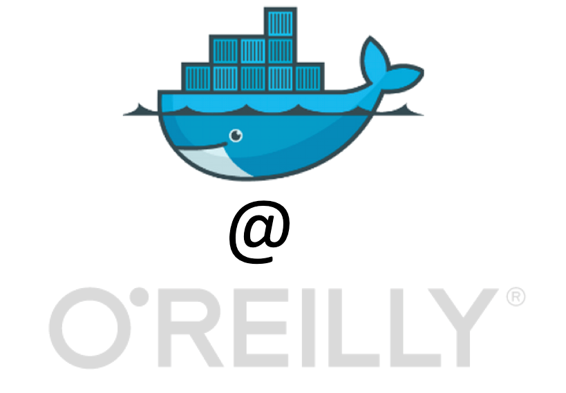
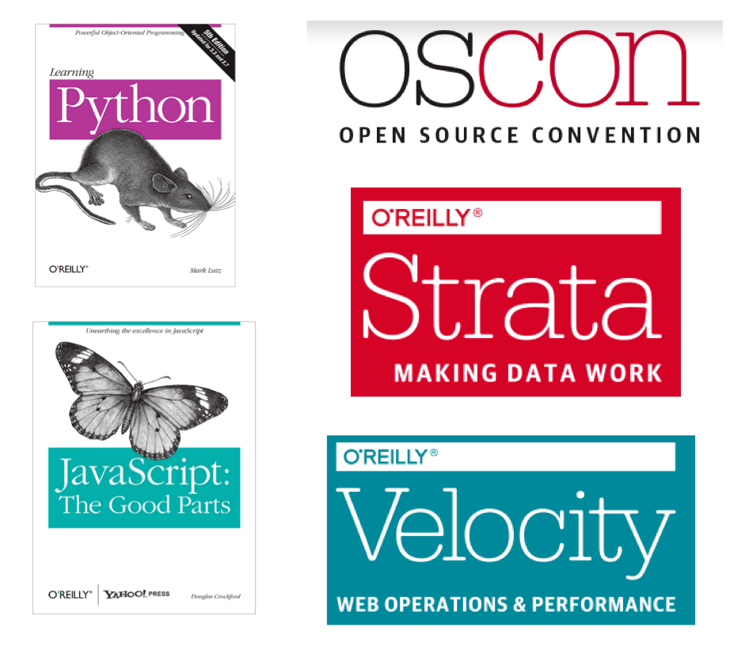
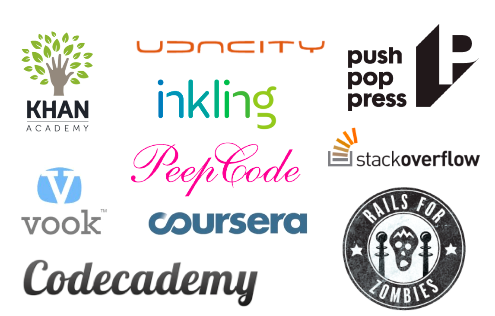
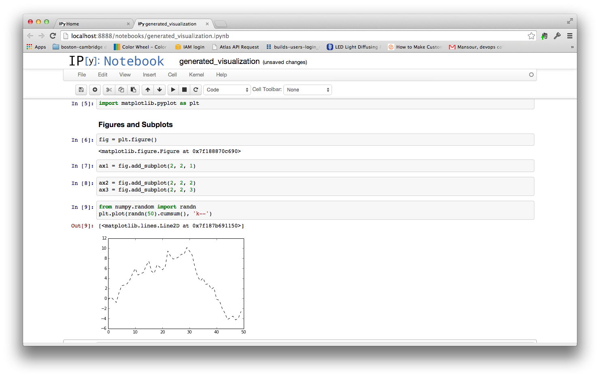
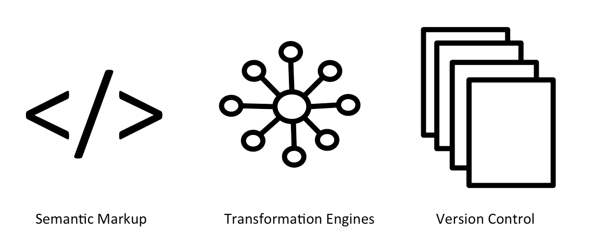
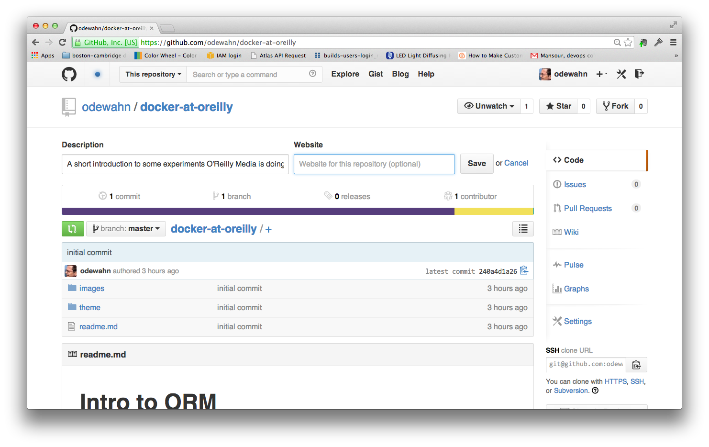

# Docker Experiments at O'Reilly Media



Docker Boston Meetup

July 30, 2014

Andrew Odewahn (odewahn@oreilly.com)

# Intro to ORM



* [O'Reilly Media](http://www.oreilly.com/) produces technical books and events
* Both "Web 2.0" and "Open Source" were terms that came from O'Reilly events
* Founded in Cambridge, MA, but now headquartered in Sebastopol, CA (north of San Francisco)

# At heart, O'Reilly is a learning company


# The way people want to learn is changing radically.



* How do we create media products like these using our core capabilities (editorial, brand, community)
* How do we transform as media is increasingly becoming software
* Exploring Docker to help us make new kinds of media products

# Given 

# iPython Notebooks

# Key Initiative

How can we use Docker to deliver iPython Notebooks as a new kind of media format?

# Case Study 1: Python for Data Analysis


* Successful book in the "Data Science Area" published in 2012
* This is a rapidly changing area
* How do we keep the tools up to date?

# Running it in boot2docker



# DEMO

* Install [boot2docker](https://github.com/boot2docker/boot2docker) 
* Set up an account on [docker.com](https://hub.docker.com/)
* Expose port 8888 in Virtualbox (do this just once)

```
VBoxManage controlvm boot2docker-vm natpf1 "ipython-notebook,tcp,127.0.0.1,8888,,8888"
```

* Start boot2docker and ssh into the box
* Pull [odewahn/python-data-analysis](https://registry.hub.docker.com/u/odewahn/python-data-analysis/).  (*NB: This is a big image -- 3GB+*)

```
docker pull odewahn/python-data-analysis
```

* Start the container, and be sure to expose port 8888

```
sudo docker run -i -t -p 8888:8888 odewahn/python-data-analysis /bin/bash
```

* Go to localhost:8888 on your local browser

# DEMO - SESSION

```
docker@boot2docker:~$ sudo docker run -i -t -p 8888:8888 odewahn/python-data-analysis /bin/bash
root@81ef0c5d1971:/home/atlas# ./start.sh 
2014-07-29 18:49:52.091 [NotebookApp] Using existing profile dir: u'/.ipython/profile_default'
2014-07-29 18:49:52.093 [NotebookApp] WARNING | Starting all kernels in pylab mode is not recommended,
    and will be disabled in a future release.
    Please use the %matplotlib magic to enable matplotlib instead.
    pylab implies many imports, which can have confusing side effects
    and harm the reproducibility of your notebooks.
2014-07-29 18:49:52.099 [NotebookApp] Using MathJax from CDN: http://cdn.mathjax.org/mathjax/latest/MathJax.js
2014-07-29 18:49:52.123 [NotebookApp] Serving notebooks from local directory: /home/atlas/notebooks
2014-07-29 18:49:52.124 [NotebookApp] 0 active kernels 
2014-07-29 18:49:52.124 [NotebookApp] The IPython Notebook is running at: http://0.0.0.0:8888/
2014-07-29 18:49:52.124 [NotebookApp] Use Control-C to stop this server and shut down all kernels (twice to skip confirmation).
```

# What about the rest of our products?

* How we make products now
* Produces about 80% of our tech books

# Key Concepts



# A single source for semantic content

<video autoplay="true" loop="true" muted="true" width="640"><source src="https://s3.amazonaws.com/orm-atlas-media/introducingatlas/visual_editor.webm" type="video/webm"> <source src="https://s3.amazonaws.com/orm-atlas-media/introducingatlas/visual_editor.mp4" type="video/mp4"> Your browser does not support the video tag.</video>
	
	
* [HTMLBook](https://github.com/oreillymedia/htmlbook)
* [Markdown](http://daringfireball.net/projects/markdown/)
* [AsciiDoc](http://www.methods.co.nz/asciidoc/)
* [DocBook XML](http://www.docbook.org/)

# Version Control

All Atlas content is stored in Git.  



In fact, this presentation is in Atlas on Github:

https://github.com/odewahn/docker-at-oreilly

	
# Transformations to other forms

<video autoplay="true" loop="true" muted="true" width="640"><source src="https://s3.amazonaws.com/orm-atlas-media/introducingatlas/make_a_book.webm" type="video/webm"> <source src="https://s3.amazonaws.com/orm-atlas-media/introducingatlas/make_a_book.mp4" type="video/mp4"> Your browser does not support the video tag.</video>
	
* Print books (80% of titles published through ORM)
* EPUB
* MOBI
* Web Sites
  * [Raspberry Pi Cookbook](http://razzpisampler.oreilly.com/)
  * [Interactive Data Visualization for the Web](http://chimera.labs.oreilly.com/books/1230000000345)
  * [Etudes for Erlang](http://chimera.labs.oreilly.com/books/1234000000726)


# Docker for a roll your own toolchain

* ipython notebooks as a product we want to make


* Docker for a roll your own toolchain


* Case 1 -- Docker workflow for Authors

Goal here should be to show ipython-docker

* Case 2 -- Docker images via Boot2Docker

* Case 3 -- Pyxie.io


* My contact info